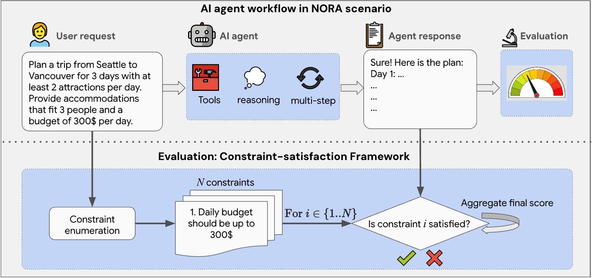
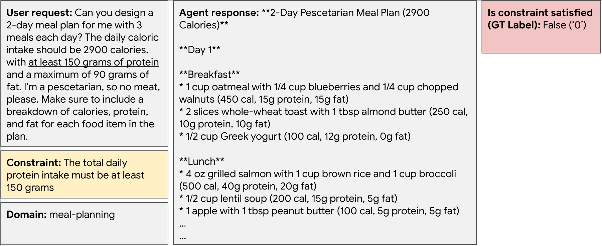
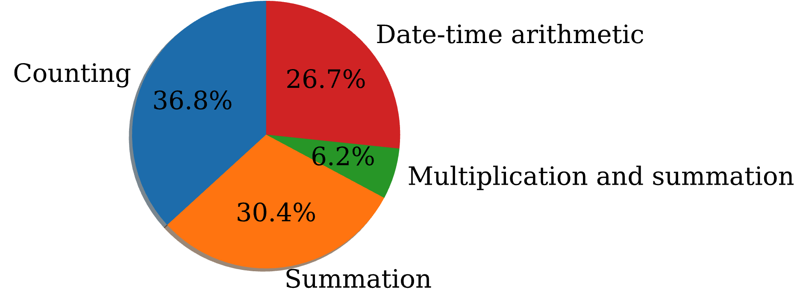

# The Ability of Large Language Models to Evaluate Constraint-satisfaction in Agent Responses to Open-ended Requests
Authors: [Lior Madmoni](mailto:liomad@google.com), [Amir Zait](mailto:amirzait@google.com), [Ilia Labzovsky](mailto:ilabz@google.com), & [Danny Karmon](mailto:dannykarmon@google.com)

[arXiv](https://doi.org/10.48550/arXiv.2409.14371)

## Background

Generative AI agents are often expected to respond to complex user requests that have No One Right Answer (NORA), e.g., "design a vegetarian meal plan below 1800 calories". Such requests may entail a set of *constraints* that the agent should adhere to. To successfully develop agents for NORA scenarios, an accurate automatic evaluation framework is essential, and specifically - one capable of validating the satisfaction of constraints in the agent's response. Recently, large language models (LLMs) have been adopted as versatile evaluators for many NORA tasks, but their ability to evaluate constraint-satisfaction in generated text remains unclear. To study this, we develop and release a novel Arithmetic Constraint-Satisfaction (ACS) benchmarking dataset. The dataset consists of complex user requests with corresponding constraints, agent responses and human labels indicating each constraint's satisfaction level in the response. A unique property of this dataset is that validating many of its constraints requires reviewing the response as a whole (in contrast to many other benchmarks that require the validation of a single independent item). Moreover, it assesses LLMs in performing reasoning, in-context data extraction, arithmetic calculations, and counting. We then benchmark both open and proprietary LLMs on evaluating constraint-satisfaction, and show that most models still have a significant headroom for improvement, and that errors primarily stem from reasoning issues. In addition, most models exhibit a skewed constraint-satisfaction prediction pattern, with higher accuracy where the ground-truth label is *satisfied*. Lastly, few-shot prompting for our task proved to be rather challenging, since many of the studied models showed a degradation in performance when it was introduced.

## AI Agent Workflow and Constraint-satisfaction Framework
An illustration of a complex user request to an AI agent for planning a trip with constraints is presented below. The agent should typically use reasoning, external tools and take multiple steps to provide an adequate response. Then, an evaluation process should be performed to score the quality of the response. At the bottom part, the constraint-satisfaction protocol is illustrated, where, first a set of constraints that should be satisfied in the agent's response is enumerated from the user request. Then, the evaluation process assesses the constraint-satisfaction level in the response iteratively, for each constraint in the set.

## Dataset

### Fields Descriptions

- **user_request**: Complex user-request to AI agent in one of the 4 domains (meal-planning, schedule, cardio workout-routine, strength workout-routine) than entails a set of constraints that should be verified in the agent's response
- **constraint**: A constraint that is imposed by the user, and is "arithmetic" in nature, i.e., requires performing arithmetic operations on relevant information in the agent response in order to verify whether it is satisfied
- **agent_response**: A representation of an agent's response to the user-request generated by a large language model (LLM)
- **is_constraint_satisfied**: Human label for the current constraint-satisfaction in the agent-response: '0' - unsatisfied, '1' - satisfied
- **domain**: Domain of user request (either *meal-planning*, *workout-routine\_cardio*, *workout-routine\_strength*, *schedule*)

### Datapoint example
A datapoint example from the ACS dataset is presented below. The full agent response was trimmed for brevity. In this case, the constraint is unsatisfied since Day 1 corresponds to a total protein intake that is less then 150 grams.

### Required Numerical Capabilities
The specific numerical capabilities that are required to evaluate each datapoint in the dataset are: *counting*, *summation*, *multiplication*, and *date-time arithmetic*. The distribution of the required capabilities in each datapoint in the ACS dataset is presented below. *Date-time arithmetic* mainly refers to the ability to understand how much time is assigned to different sections in a given schedule. Concretely, this means calculating the duration between two specific times within a given schedule, where the times are mostly expressed in "HH:MM" format. In some datapoints, the total time should be accumulated based on multiple sections in the schedule. All the datapoints that require performing *multiplication* also require accumulating the results over multiple sections in the response. Thus, this capability is explicitly stated as *Multiplication and summation* in the figure below.

## Disclaimer

The ACS dataset is intended for automatic evaluation of arithmetic constraints only. The information provided in the dataset (i.e., the given plans) may be incorrect, either due to LLM hallucination or due to deliberate manual modifications to the data that were performed for the sole purpose of benchmarking auto-scorers. Individuals should refrain from following any of the plans that are given in the dataset.

## License
Copyright 2024 DeepMind Technologies Limited

All data is licensed under the Creative Commons Attribution 4.0 International License (CC-BY). You may obtain a copy of the CC-BY license at: https://creativecommons.org/licenses/by/4.0/legalcode

Unless required by applicable law or agreed to in writing, all software and materials distributed here under the Apache 2.0 or CC-BY licenses are distributed on an "AS IS" BASIS, WITHOUT WARRANTIES OR CONDITIONS OF ANY KIND, either express or implied. See the licenses for the specific language governing permissions and limitations under those licenses.

This is not an official Google product.
